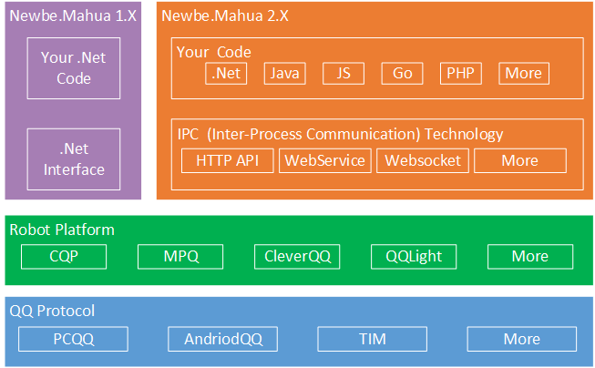

# Newbe.Mahua.Framework

先点击一下右上角的Star，开启隐藏功能。

## 入坑提示

建议开发者先根据自身需求结合表格，选择属于自己的专属开发框架，避免浪费时间。

1. 编写一套代码就能在多个平台运行
2. 支持使用除了C#之外的开发语言来开发
3. 我希望他足够简单，不用学习太多就能掌握，通常只需要半个小时就能掌握所有内容
4. 我希望社区的反馈足够快，有问题都可以帮我解决

| SDK名称                                                                     | （1） | （2） | （3） | （4） |
| --------------------------------------------------------------------------- | ----- | ----- | ----- | ----- |
| 论坛中的其他SDK                                                             | ✔     | ✔     | ✔     | ✔     |
| [Jie2GG.Native.Csharp.Frame](https://github.com/Jie2GG/Native.Csharp.Frame) | ✔     | ✘     | ✔     | ✔     |
| [Newbe.Mahua V2](https://github.com/newbe36524/Newbe.Mahua.Framework/)      | ✔     | ✔     | ✘     | ✘     |
| [Newbe.Mahua V1](https://github.com/newbe36524/Newbe.Mahua.Framework.V1)    | ✔     | ✘     | ✘     | ✘     |

### 论坛其他SDK的链接

- [CQP](https://d.oo14.com/b7oy?target=cqp)         
- [MPQ](https://d.oo14.com/b7oy?target=mpq)         
- [QQLight](https://d.oo14.com/b7oy?target=qqlight) 

## 开篇一张图，功能全靠编

真正的勇士，看图就明白了其中的道理。

## 你打麻花，谁疼？麻花疼。

QQ协议实现也有不少，QQ机器人平台有不少，这些平台大多具有不同的接口，对接开发存在巨大困难。

使用该SDK开发可以实现一次开发，运行于多个不同平台的绝佳体验。

支持容器管理生命周期，依赖注入，便于进行单元测试，确保开发效率。

你只要基于SDK的接口开发一次，便可以将你的插件发布到所有支持的QQ机器人平台。

不用担心某个平台被咔嚓。

## 立马开始

[点击查看帮助文档开始编写第一个QQ机器人。](https://d.oo14.com/08ZI?v=v1)

### 快乐实践

[我想将我的项目加在此处](https://github.com/newbe36524/Newbe.Mahua.Framework.V1/issues/new/choose)
 
#### [i春秋社区机器人](https://github.com/0nise/ichunqiu_qqbot)
 
i春秋社区机器人自2018年02月04日开始服务于i春秋社区，每日文章推送、文章查询、魔法币查询、作者信息查询、作家团奖金余额查询、奖金排行榜、i春秋课程查询等一列功能。据不完全统计，使用人数已经超过3.5万，使用次数达到20万，最大覆盖700+个群。

#### [Repeater Breaker](https://github.com/CinikiC/QQbot-RepeaterBreaker)
 
顾名思义，Repeater Breaker是专门针对QQ群中的复读现象开发的检测机器人，是各位群主治理复读机的辅助工具。

#### [EVE-Marketsearch](https://github.com/Jimesarrice/EVE-Marketsearch)
 
群机器人查询EVE市场价格。

#### [Zhou.QQRobot](https://github.com/LabelZhou/Zhou.QQRobot)
 
程序喵群机器人

#### [QQ群签到机器人](https://github.com/Jimesarrice/Gemeral_QQSignin_Framework)

实现了基础的QQ群签到的功能，数据库可以存储每个用户的签到天数，积分，最后签到日期，以此来配合一切其他群管理模块，用户每天可以签到一次，随机获取积分，积分可配合其他功能进行消费，每天对每个已签到用户生成一个近似随机的人品值以供娱乐，签到时间不同对每个用户划分等级，以显示用户活跃程度。
通过二次开发可以扩展很多玩法。

## 版本

| 包                            | 版本                                                                                                                                                                                          | 下载量                                                                                                                                                                                 | 开发版                                                                                                                                                                                      | 说明                         |
| ----------------------------- | --------------------------------------------------------------------------------------------------------------------------------------------------------------------------------------------- | -------------------------------------------------------------------------------------------------------------------------------------------------------------------------------------- | ------------------------------------------------------------------------------------------------------------------------------------------------------------------------------------------- | ---------------------------- |
| Newbe.Mahua                   |                                                        |                                               |                                               | 核心接口                     |
| Newbe.Mahua.PluginLoader      |                 |        |        | 核心运行时                   |
| Newbe.Mahua.Tools.Psake       |                    |           |           | 工具包                       |
| Newbe.Mahua.Administration    |           |  |  | WPF版设置中心                |
| Newbe.Mahua.CQP               |                                            |                                   |                                   | CQP（酷Q）实现               |
| Newbe.Mahua.QQLight           |                                |                       |                       | QQLight实现                  |
| Newbe.Mahua.MPQ               |                                            |                                   |                                   | MPQ（MyPcQQ）实现            |
| Newbe.Mahua.CQP.ApiExtensions |  |       |       | 对CQP进行API扩展             |
| ~~Newbe.Mahua.Amanda~~        |                                   |                          |                          | Amanda实现（已经停止维护）   |
| ~~Newbe.Mahua.CleverQQ~~      |                             |                    |                    | CleverQQ实现（已经停止维护） |

## 相关链接

- [支持的事件和API](docs/API.md)
- [阅读和使用源码](docs/How-To-Use-Source-Code.md)

## 说在最后面

开发本SDK的目的是为了促进.Net技术的交流学习。

由本SDK衍生的任何产品均与本SDK无关！

由本SDK支持的QQ自动化管理助手平台均与本SDK无关！

禁止用于国家或地区法律法规所禁止的范围！

**最后，但是最重要的，一定要Star一下！**

特别感谢 Jetbrain 公司提供的 License 以支持该项目

## Contributors

Thanks goes to these wonderful people ([emoji key](https://github.com/kentcdodds/all-contributors#emoji-key)):

<!-- ALL-CONTRIBUTORS-LIST:START - Do not remove or modify this section -->
<!-- prettier-ignore -->
<table>
  <tr>
    <td align="center"><a href="http://www.newbe.pro"> <b>Newbe36524</b></a> <a href="https://github.com/newbe36524/Newbe.Mahua.Framework.V1/commits?author=newbe36524" title="Documentation">📖</a> <a href="https://github.com/newbe36524/Newbe.Mahua.Framework.V1/commits?author=newbe36524" title="Code">💻</a> <a href="#tool-newbe36524" title="Tools">🔧</a> <a href="#blog-newbe36524" title="Blogposts">📝</a> <a href="#example-newbe36524" title="Examples">💡</a></td>
    <td align="center"><a href="https://traceless.site/"> <b>Traceless</b></a> <a href="https://github.com/newbe36524/Newbe.Mahua.Framework.V1/issues?q=author%3Atraceless0929" title="Bug reports">🐛</a></td>
    <td align="center"><a href="https://github.com/kotoneme"> <b>kotoneme</b></a> <a href="https://github.com/newbe36524/Newbe.Mahua.Framework.V1/commits?author=kotoneme" title="Code">💻</a></td>
    <td align="center"><a href="https://github.com/allenxie888"> <b>AllenXie</b></a> <a href="https://github.com/newbe36524/Newbe.Mahua.Framework.V1/commits?author=allenxie888" title="Code">💻</a></td>
    <td align="center"><a href="https://github.com/bgli100"> <b>bgli100</b></a> <a href="https://github.com/newbe36524/Newbe.Mahua.Framework.V1/issues?q=author%3Abgli100" title="Bug reports">🐛</a></td>
    <td align="center"><a href="https://github.com/newce36524"> <b>Q-Q</b></a> <a href="https://github.com/newbe36524/Newbe.Mahua.Framework.V1/issues?q=author%3Anewce36524" title="Bug reports">🐛</a></td>
    <td align="center"><a href="https://github.com/LollipopGeneral"> <b>LollipopGeneral</b></a> <a href="https://github.com/newbe36524/Newbe.Mahua.Framework.V1/commits?author=LollipopGeneral" title="Code">💻</a></td>
  </tr>
  <tr>
    <td align="center"><a href="https://github.com/LabelZhou"> <b>LabelZhou</b></a> <a href="#ideas-LabelZhou" title="Ideas, Planning, & Feedback">🤔</a></td>
    <td align="center"><a href="http://www.r4v3zn.com"> <b>r4v3zn</b></a> <a href="#ideas-0nise" title="Ideas, Planning, & Feedback">🤔</a></td>
    <td align="center"><a href="https://github.com/CinikiC"> <b>Ciniki</b></a> <a href="#ideas-CinikiC" title="Ideas, Planning, & Feedback">🤔</a></td>
    <td align="center"><a href="https://github.com/Jimesarrice"> <b>Jimes</b></a> <a href="#ideas-Jimesarrice" title="Ideas, Planning, & Feedback">🤔</a></td>
  </tr>
</table>

<!-- ALL-CONTRIBUTORS-LIST:END -->

This project follows the [all-contributors](https://github.com/kentcdodds/all-contributors) specification. Contributions of any kind welcome!

## Stargazers over time

